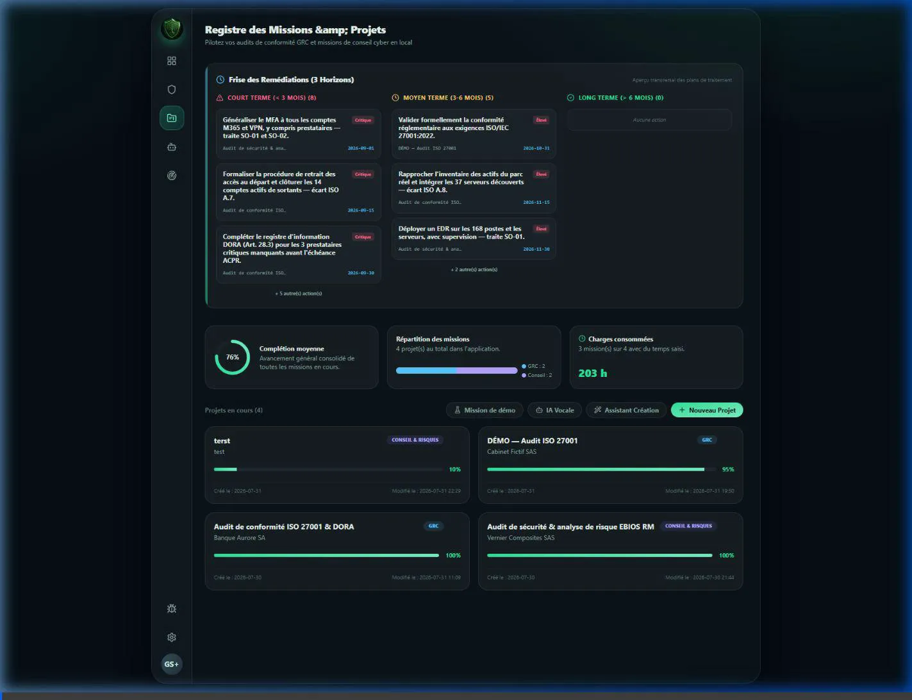
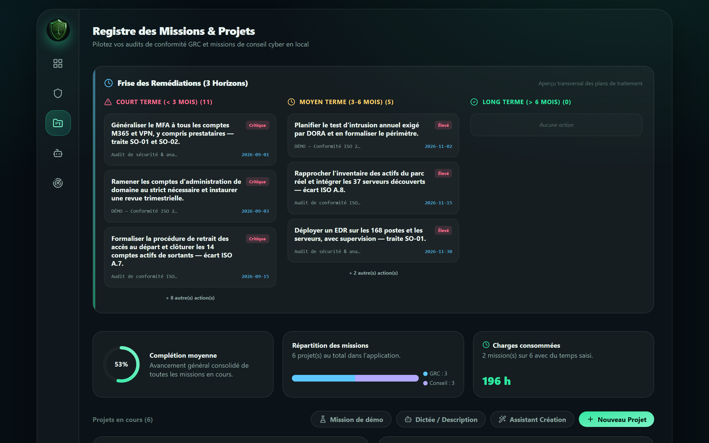
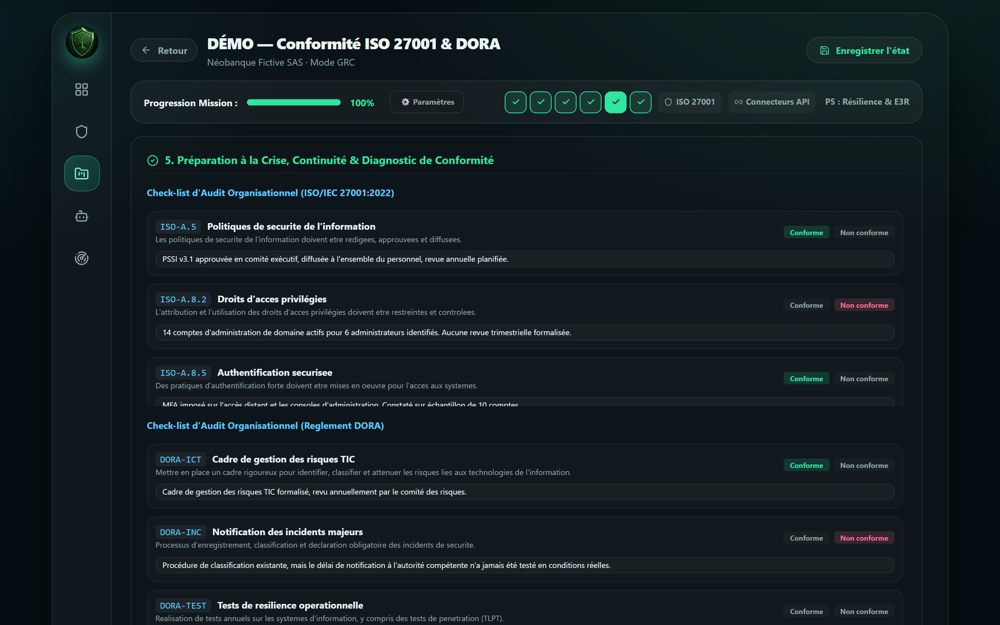
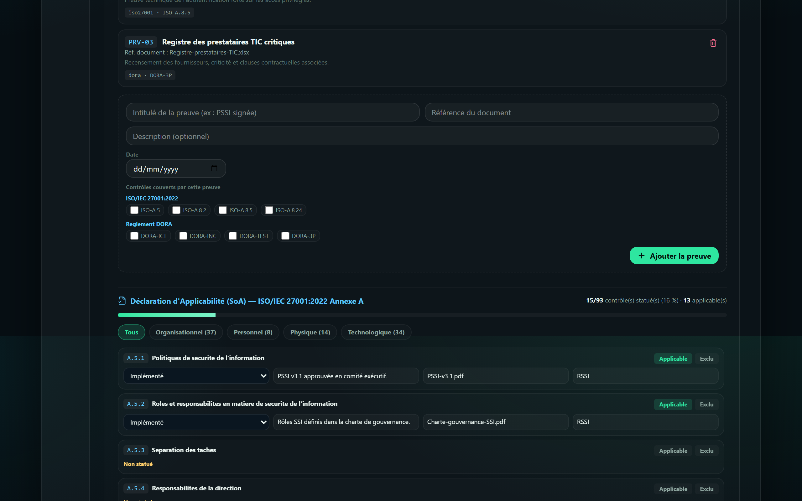
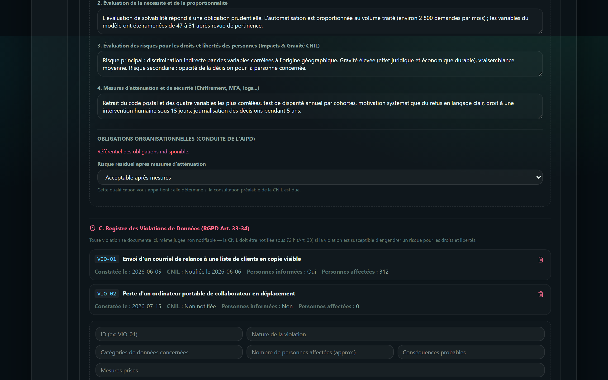
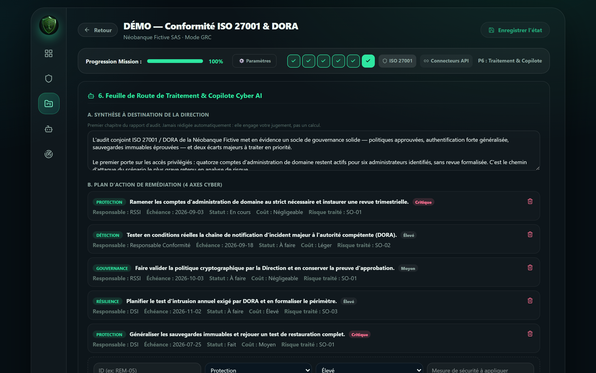

<div align="center">


# 🟢 GREEN SHIELD

**Cockpit de conduite de mission pour consultant cybersécurité — 100 % local.**

Un environnement d'audit moderne, hors-ligne et modulaire, qui guide une mission GRC de la phase de cadrage jusqu'à la restitution au Comex.


</div>

---

## 📸 Aperçu de la plateforme

<p align="center">
  
  <br>
  <em>Navigation et sauvegarde d'une mission.</em>
</p>

Les captures ci-dessous proviennent de la **mission de démonstration** livrée avec l'outil — entièrement fictive, générée en un clic, et régénérable par [`scripts/captures_readme.py`](scripts/captures_readme.py).

<p align="center">
  
  <br>
  <em><strong>Registre des missions.</strong> Frise des remédiations consolidée sur trois horizons (court / moyen / long terme), toutes missions confondues, avec charges consommées et complétion moyenne.</em>
</p>

<p align="center">
  
  <br>
  <em><strong>Multi-référentiel.</strong> Une même mission porte ISO 27001 <em>et</em> DORA : chaque check-list est regroupée par référentiel, et les livrables indiquent l'origine de chaque contrôle.</em>
</p>

<p align="center">
  
  <br>
  <em><strong>Preuves et Déclaration d'Applicabilité.</strong> Une preuve peut couvrir des contrôles de plusieurs référentiels à la fois. En dessous, les 93 contrôles de l'Annexe A avec leur justification d'inclusion ou d'exclusion.</em>
</p>

<p align="center">
  
  <br>
  <em><strong>Registre des violations (RGPD Art. 33-34).</strong> Toute violation se documente, même jugée non notifiable. Le délai de 72 h est contrôlé avant l'export.</em>
</p>

<p align="center">
  
  <br>
  <em><strong>Revue avant export et livrables.</strong> L'outil énumère ce qui manque avant qu'un document ne parte chez le client, puis génère les six livrables en Word, PDF et Markdown.</em>
</p>

> **Envie de voir le résultat sans rien installer ?** Le dossier **[docs/exemples/](docs/exemples/)** contient les livrables bruts de deux missions fictives, générés de bout en bout par l'outil (Word, HTML, Markdown).

---

## 📖 Pourquoi GREEN SHIELD ? (Genèse du projet)

À l'aube d'un stage en consulting cybersécurité pour une association, j'ai ressenti le besoin de structurer mon approche. La sécurité de l'information est un enjeu critique où **rien ne doit être laissé au hasard**.

Pour pallier le risque d'oubliédes information importante inhérent à tout début de carrière, j'ai voulu me doter d'un outil extrêmement guidé, capable d'anticiper les oublis et de rattraper d'éventuelles erreurs. Je me suis largement inspiré des leaders du marché comme **Vanta** ou **CISO Assistant**, mais avec un objectif différent : créer un assistant de consulting **plus directif, plus pédagogique**, qui prend l'auditeur par la main.

### Une règle qui structure tout le produit : zéro invention

Un outil d'audit qui « comble les trous » est un outil dangereux : il fait signer au consultant des constats qu'il n'a pas faits. GREEN SHIELD applique donc une règle stricte, vérifiable dans le code :

- une mission neuve démarre **vide** — aucun actif, aucun tiers, aucun risque pré-rempli ;
- ce qui n'est pas saisi apparaît comme **manquant** dans le livrable, jamais comblé ;
- un LLM ne remplit **jamais** un champ structuré : il produit du texte libre affiché à l'écran, que le consultant recopie s'il le juge bon.

---

## 🛡️ Sécurité et confidentialité — ce qui est réellement garanti

Les outils que nous utilisons ne doivent pas devenir le maillon faible. Voici l'état **exact** de l'architecture, sans embellissement.

| Garantie | Détail |
|---|---|
| **Fonctionnement hors-ligne** | L'application tourne intégralement en local (`127.0.0.1`). Sans clé API, le Copilote répond depuis un moteur local qui construit sa réponse à partir des données réelles de la mission. Aucune donnée ne sort. |
| **Chiffrement au repos par défaut** | Chaque mission est chiffrée sur disque (**Fernet**, AES-128-CBC + HMAC) dès l'écriture, sans configuration : la clé est générée une fois puis conservée hors dépôt. Les instantanés de phase suivent la même protection. |
| **Données hors du dépôt** | Les missions vivent dans `%APPDATA%\GreenShield` (Windows) / `$XDG_DATA_HOME` (Linux), jamais dans le dépôt git. Une mise à jour ou un `git clean` ne peut pas les détruire. |
| **Archives chiffrées** | L'export d'une mission produit une archive **AES-256** (standard WinZip, lisible par 7-Zip), protégée par le mot de passe choisi par le consultant — jamais par la clé de chiffrement au repos du poste. L'import est durci contre le Zip Slip et les bombes de décompression. |
| **Journal d'audit** | Chaque action sensible (création, suppression, export, purge, appel au Copilote) est tracée dans `logs/audit.log`. Le contenu des missions n'y figure jamais. |
| **Rétention RGPD** | Les entretiens contiennent des données personnelles : une durée de conservation est définie par mission, avec purge qui efface les personnes interrogées **sans jamais toucher aux constats d'audit**. |
| **Versionnement** | Un instantané est pris à chaque validation de phase et avant toute opération destructive. Aucune action n'est un aller sans retour. |

### Sortie réseau : les deux seuls cas, explicites

L'application est hors-ligne **par défaut**. Deux fonctionnalités, et deux seulement, peuvent émettre du trafic — toujours sur action volontaire :

1. **Copilote en ligne** — si (et seulement si) vous saisissez une clé API Gemini. La clé est conservée en `sessionStorage` (effacée à la fermeture de l'onglet), **jamais persistée côté serveur ni journalisée** ; elle transite par le backend qui la relaie à l'API sans la stocker. Sans clé, le repli local s'applique et rien ne sort.
2. **Dictée vocale** — elle s'appuie sur le service de reconnaissance vocale du navigateur, qui transmet l'audio à son éditeur. L'interface le signale à l'endroit où l'on dicte. Préférez le clavier pour tout élément confidentiel.

> ℹ️ **Chiffrement au repos.** Depuis le 06/08/2026, chaque mission est chiffrée sur disque par défaut — plus besoin de définir une variable d'environnement. Un chiffrement de disque complémentaire (BitLocker / LUKS) reste recommandé en défense en profondeur, mais n'est plus la seule protection.

> ℹ️ **Portée du masquage automatique.** Le module d'anonymisation couvre aujourd'hui les **adresses IP, courriels et noms de domaine**. Il ne détecte **pas** les noms de personnes ou d'organisations. Ne comptez pas dessus pour caviarder un nom de client.

---

## 🎯 Ce que fait l'outil

### Conduite de mission guidée — 6 phases

| Phase | Contenu |
|---|---|
| **1. Cadrage & Patrimoine** | Périmètre, NDA, valeurs métier, biens supports, socle de mission (qualification, contractualisation, kick-off, entretiens). |
| **2. Diagnostic & RGPD** | Hygiène, registre des traitements (Art. 30), **AIPD** avec ses 5 obligations organisationnelles, **registre des violations** (Art. 33-34). |
| **3. Risques Tiers (TPRM)** | Volet Conseil : ratio **ANSSI** `(dépendance × pénétration) / (maturité × confiance)`. Volet GRC : exigences DORA/NIS2 vérifiables, **sans score** — ces référentiels ne se réclament pas d'EBIOS. |
| **4. Analyse des menaces** | **EBIOS RM** : événements redoutés, sources de risque, scénarios opérationnels, cas réels. |
| **5. Résilience & Conformité** | RTO/RPO, séquence **E3R** de l'ANSSI, volet stratégique d'arbitrage Direction, check-list d'audit par référentiel, **Déclaration d'Applicabilité**, bibliothèque de preuves. |
| **6. Traitement & Livrables** | Plan de remédiation piloté, risques acceptés, revue avant export, génération des livrables. |

### Fonctionnalités structurantes

- **🗂️ Multi-référentiel par mission** — une même mission peut porter **ISO 27001 + DORA + NIS2** simultanément. La check-list se regroupe par référentiel, et les livrables indiquent l'origine de chaque contrôle. C'est le cas réel d'un établissement financier visant la certification.
- **📋 Déclaration d'Applicabilité (SoA)** — les **93 contrôles de l'Annexe A ISO 27001:2022**, avec justification d'inclusion *et* d'exclusion. C'est le premier document qu'un auditeur de certification réclame. Livrable dédié (Word + Markdown).
- **🔗 Bibliothèque de preuves multi-référentiels** — une preuve écrite une fois (une PSSI signée, un contrat) peut couvrir des contrôles de **plusieurs référentiels** à la fois. Fini la ressaisie.
- **⚖️ Registre des violations RGPD** — toute violation se documente, **même jugée non notifiable** (Art. 33 §5). La règle des **72 h** est vérifiée : une violation non notifiée et non justifiée passé ce délai devient un manque **bloquant** avant export.
- **🔁 Chaîne risque → traitement** — chaque scénario porte un propriétaire, un risque résiduel, une stratégie (Réduire / Accepter / Transférer / Éviter) et un statut. Sans propriétaire ni décision, un scénario n'est qu'une observation.
- **✅ Revue avant export** — l'outil énumère ce qui manque **avant** qu'un livrable ne parte chez le client, en distinguant bloquant et recommandé. Il ne remplit rien : il rend l'incomplétude visible.
- **📄 Exports multi-formats** — NDA, EBIOS RM, PSSI/PRI, AIPD, Déclaration d'Applicabilité et rapport de mission, en **Word (`python-docx`), HTML et Markdown**, à l'identité de votre cabinet (logo, nom, coordonnées).
- **⏱️ Suivi des charges** — temps consommé par phase, comparé au budget vendu, repris dans le rapport.
- **🔬 AuditCraft-GRC** — analyse hors-ligne de fichiers de configuration (`sshd_config`, `nginx.conf`) rattachée aux référentiels **CIS v8 / NIST CSF 2.0**, avec un **taux de couverture technique** affiché honnêtement : ce qui repose sur du déclaratif est annoncé comme tel.

### 🚀 Mission de démonstration

Un clic sur **« Mission de démo »** génère une mission **entièrement fictive** (« Néobanque Fictive SAS »), explicitement marquée, qui traverse chaque fonctionnalité : deux référentiels actifs, une SoA partiellement statuée, des preuves partagées entre référentiels, deux violations RGPD illustrant les deux branches de l'article 33, une AIPD conduite, quatre scénarios EBIOS et un plan de traitement piloté.

Elle permet de démontrer l'outil **sans jamais ouvrir une mission cliente réelle** — et de vérifier après chaque évolution que la chaîne complète fonctionne encore.

---

## 🛠️ Savoir-faire normatif mis en œuvre

- **Référentiels** : ISO/IEC 27001:2022 (dont les 93 contrôles de l'Annexe A), DORA, NIS2, RGPD, NIST CSF 2.0, EU AI Act.
- **Méthodes** : EBIOS RM (ANSSI), AIPD/PIA (CNIL), séquence de remédiation E3R (ANSSI), ratio de criticité tiers ANSSI.
- **Architecture** : React 19 + Vite + Tailwind v4 (TypeScript strict) / FastAPI + Python 3.12, données en fichiers JSON/YAML à plat, empaquetage Docker Compose.
- **Qualité** : **700 tests backend (pytest) et 183 tests frontend (vitest)**, schéma de mission versionné avec chaîne de migration rejouable, écritures atomiques.

> **Respect du droit d'auteur des normes** : les référentiels embarqués ne contiennent que des **identifiants et intitulés courts reformulés**. Aucun texte normatif ISO/AFNOR n'est reproduit.

---

## 🚀 Installation & démarrage

```bash
# Lancement via Docker (recommandé)
make up          # construit et lance l'app sur http://localhost:8080
```

> Sans `make` (Windows) : `docker compose up --build -d`.

### En développement

```bash
# Backend
cd api && py -3 -m uvicorn main:app --reload --port 8000

# Frontend
cd web && npm install && npm run dev
```

### Tests

```bash
py -3 -m pytest api/tests -q      # 700 tests backend
cd web && npx vitest run          # 183 tests frontend
cd web && npx tsc --noEmit        # typage strict
```

### Configuration recommandée

| Variable | Rôle |
|---|---|
| `GREENSHIELD_API_SECRET` | Secret de signature des jetons de session. **À définir en déploiement** : sinon un secret est généré et conservé localement au premier démarrage. |
| `GREENSHIELD_STORAGE_KEY` | Clé de chiffrement des missions (Fernet). **Optionnelle** : une clé est générée et conservée localement au premier démarrage si absente. À définir pour imposer une clé externe (ex. gestion centralisée). |
| `GREENSHIELD_DATA_DIR` | Répertoire des missions. Par défaut `%APPDATA%\GreenShield\projects`. |

---

## ⚖️ Licence & usage

[PolyForm Noncommercial 1.0.0](LICENSE.md).
Ce projet est partagé en open source pour contribuer à la communauté cyber et démontrer mon approche du métier.

- ✅ Lecture, étude, modification, usage associatif ou enseignement.
- ❌ Revente, intégration commerciale ou utilisation en SaaS payant.

---

*GREEN SHIELD — Un projet conçu à l'intersection de la cybersécurité et de l'ingénierie logicielle.*

---
---

<div align="center">

# 🟢 GREEN SHIELD — English version

**A mission cockpit for cybersecurity consultants — fully local.**

</div>

## 📖 Why GREEN SHIELD?

Starting a cybersecurity consulting internship, I needed to structure my approach. Information security is a field where **nothing should be left to chance**. To offset the inexperience that comes with any career start, I wanted a highly guided tool — one that anticipates omissions and catches mistakes.

I drew inspiration from market leaders like **Vanta** and **CISO Assistant**, with a different goal: a **more directive, more pedagogical** consulting assistant that walks the auditor from scoping through to the executive debrief.

### The rule that shapes the whole product: invent nothing

An audit tool that "fills in the blanks" is a dangerous tool — it makes the consultant sign off on findings they never made. GREEN SHIELD enforces a strict rule, verifiable in the code:

- a new engagement starts **empty** — no pre-filled assets, third parties or risks;
- anything left blank appears as **missing** in the deliverable, never quietly filled;
- an LLM **never** writes into a structured field: it produces free text on screen, which the consultant copies over only if they judge it sound.

## 🛡️ Security and confidentiality — what is actually guaranteed

| Guarantee | Detail |
|---|---|
| **Offline operation** | Runs entirely locally (`127.0.0.1`). Without an API key, the Copilot answers from a local engine built on the engagement's real data. Nothing leaves the machine. |
| **Encryption at rest by default** | Every engagement is encrypted on disk (**Fernet**, AES-128-CBC + HMAC) as soon as it is written, no configuration needed: the key is generated once and kept outside the repository. Phase snapshots get the same protection. |
| **Data outside the repository** | Engagements live in `%APPDATA%\GreenShield` (Windows) / `$XDG_DATA_HOME` (Linux), never in the git repo. An update or a `git clean` cannot destroy them. |
| **Encrypted archives** | Exporting an engagement produces an **AES-256** archive (WinZip AES standard, readable by 7-Zip), protected by the password the consultant chooses — never by the machine's at-rest encryption key. Import is hardened against Zip Slip and decompression bombs. |
| **Audit log** | Every sensitive action (creation, deletion, export, purge, Copilot call) is recorded in `logs/audit.log`. Engagement content never appears there. |
| **GDPR retention** | Interviews hold personal data: a retention period is set per engagement, and the purge erases interviewees **without ever touching audit findings**. |
| **Versioning** | A snapshot is taken at every phase validation and before any destructive operation. No action is a one-way door. |

### Network egress: the only two cases, both explicit

The application is offline **by default**. Two features — and only two — can generate traffic, always on a deliberate action:

1. **Online Copilot** — only if you enter a Gemini API key. The key is held in `sessionStorage` (cleared when the tab closes), **never persisted server-side nor logged**; it passes through the backend, which relays it to the API without storing it. With no key, the local fallback applies and nothing leaves.
2. **Voice dictation** — relies on the browser's speech recognition service, which sends audio to its vendor. The interface says so where you dictate. Use the keyboard for anything confidential.

> ℹ️ **Encryption at rest.** As of 2026-08-06, every engagement is encrypted on disk by default — no environment variable to set. Full-disk encryption (BitLocker / LUKS) is still recommended as defence in depth, but it is no longer the only protection.

> ℹ️ **Scope of automatic masking.** The anonymisation module currently covers **IP addresses, e-mails and domain names**. It does **not** detect personal or organisation names. Do not rely on it to redact a client name.

## 🎯 What the tool does

### Guided engagement — 6 phases

| Phase | Content |
|---|---|
| **1. Scoping & Assets** | Perimeter, NDA, business values, supporting assets, engagement foundation (qualification, contracting, kick-off, interviews). |
| **2. Diagnosis & GDPR** | Hygiene, records of processing (Art. 30), **DPIA** with its 5 procedural obligations, **personal data breach register** (Art. 33-34). |
| **3. Third-Party Risk (TPRM)** | Consulting track: **ANSSI** ratio `(dependency × penetration) / (maturity × trust)`. GRC track: verifiable DORA/NIS2 requirements, **no scoring** — those frameworks do not claim EBIOS. |
| **4. Threat analysis** | **EBIOS RM**: feared events, risk sources, operational scenarios, real-world cases. |
| **5. Resilience & Compliance** | RTO/RPO, ANSSI **E3R** sequence, executive arbitration, audit checklist per framework, **Statement of Applicability**, evidence library. |
| **6. Treatment & Deliverables** | Managed remediation plan, accepted risks, pre-export review, deliverable generation. |

### Structural features

- **🗂️ Multiple frameworks per engagement** — one engagement can carry **ISO 27001 + DORA + NIS2** at once. The checklist groups by framework, and deliverables state each control's origin. This is the real case of a financial institution pursuing certification.
- **📋 Statement of Applicability (SoA)** — all **93 Annex A controls of ISO 27001:2022**, with justification for inclusion *and* exclusion. It is the first document a certification auditor asks for. Dedicated deliverable (Word + Markdown).
- **🔗 Cross-framework evidence library** — evidence written once (a signed security policy, a contract) can cover controls across **several frameworks** at once. No more re-entry.
- **⚖️ GDPR breach register** — every breach is documented, **even one judged non-notifiable** (Art. 33(5)). The **72-hour** rule is checked: a breach neither notified nor justified past that deadline becomes a **blocking** gap before export.
- **🔁 Risk → treatment chain** — every scenario carries an owner, a residual risk, a strategy (Reduce / Accept / Transfer / Avoid) and a status. Without an owner and a decision, a scenario is merely an observation.
- **✅ Pre-export review** — the tool lists what is missing **before** a deliverable reaches the client, separating blocking from advisory. It fills nothing in: it makes incompleteness visible.
- **📄 Multi-format exports** — NDA, EBIOS RM, security policy / DR plan, DPIA, Statement of Applicability and engagement report, in **Word (`python-docx`), HTML and Markdown**, branded with your firm's identity (logo, name, details).
- **⏱️ Effort tracking** — time spent per phase against the sold budget, carried into the report.
- **🔬 AuditCraft-GRC** — offline analysis of configuration files (`sshd_config`, `nginx.conf`) mapped to **CIS v8 / NIST CSF 2.0**, with a **technical coverage rate** stated honestly: whatever rests on self-declaration is labelled as such.

### 🚀 Demonstration engagement

One click on **"Mission de démo"** generates a **fully fictional** engagement ("Néobanque Fictive SAS"), explicitly marked, that exercises every feature: two active frameworks, a partially decided SoA, evidence shared across frameworks, two GDPR breaches illustrating both branches of Article 33, a completed DPIA, four EBIOS scenarios and a managed treatment plan.

It lets you demo the tool **without ever opening a real client engagement** — and verifies, after each change, that the whole chain still works.

## 🛠️ Standards expertise applied

- **Frameworks**: ISO/IEC 27001:2022 (including all 93 Annex A controls), DORA, NIS2, GDPR, NIST CSF 2.0, EU AI Act.
- **Methods**: EBIOS RM (ANSSI), DPIA (CNIL), E3R remediation sequence (ANSSI), ANSSI third-party criticality ratio.
- **Architecture**: React 19 + Vite + Tailwind v4 (strict TypeScript) / FastAPI + Python 3.12, flat JSON/YAML storage, Docker Compose packaging.
- **Quality**: **700 backend tests (pytest) and 183 frontend tests (vitest)**, versioned engagement schema with a replayable migration chain, atomic writes.

> **Respect for standards copyright**: bundled frameworks contain only **identifiers and short reworded titles**. No ISO/AFNOR normative text is reproduced.

## 🚀 Install & run

```bash
# Via Docker (recommended)
make up          # builds and serves on http://localhost:8080
```

> Without `make` (Windows): `docker compose up --build -d`.

**Windows users**: a standalone `GreenShield.exe` is published under [Releases](../../releases) — no Python, Node or Docker required. Double-click, and your browser opens on the application.

### Development

```bash
cd api && py -3 -m uvicorn main:app --reload --port 8000   # backend
cd web && npm install && npm run dev                        # frontend
```

### Tests

```bash
py -3 -m pytest api/tests -q      # 700 backend tests
cd web && npx vitest run          # 183 frontend tests
cd web && npx tsc --noEmit        # strict typing
```

### Recommended configuration

| Variable | Purpose |
|---|---|
| `GREENSHIELD_API_SECRET` | Session token signing secret. **Set it in deployment**: otherwise a secret is generated and kept locally on first start. |
| `GREENSHIELD_STORAGE_KEY` | Engagement encryption key (Fernet). **Optional**: a key is generated and kept locally on first start if absent. Set it to enforce an external key (e.g. centralised key management). |
| `GREENSHIELD_DATA_DIR` | Engagement directory. Defaults to `%APPDATA%\GreenShield\projects`. |

## ⚖️ Licence & usage

[PolyForm Noncommercial 1.0.0](LICENSE.md). Shared open source to contribute to the cyber community and to show how I approach the work.

- ✅ Reading, study, modification, non-profit or educational use.
- ❌ Resale, commercial integration or paid SaaS use.

---

*GREEN SHIELD — Built at the intersection of cybersecurity and software engineering.*
